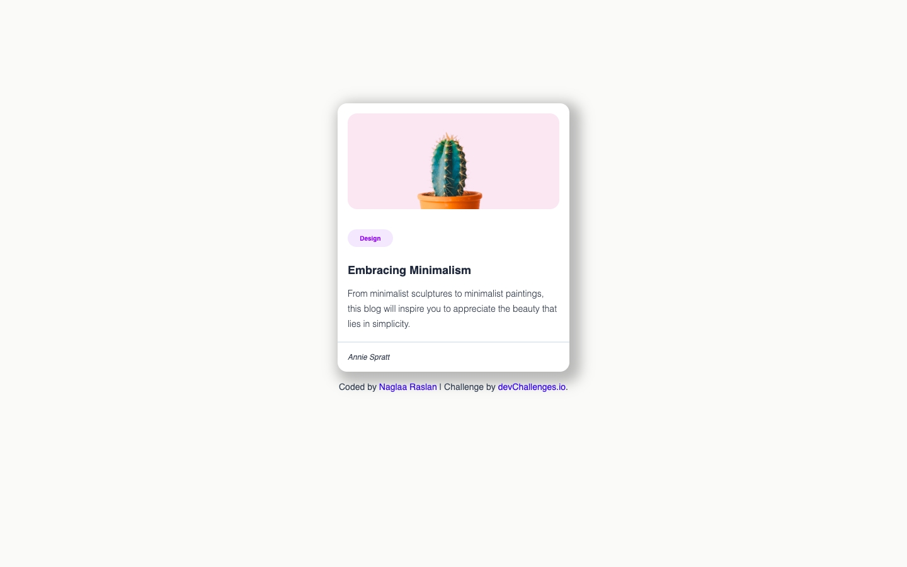

# Minimal-Blog-Card
dev challenges  project

<!-- Please update value in the {}  -->

<h1 align="center">{Minimal Blog Card} | devChallenges</h1>

   Solution for a challenge <a href="https://devchallenges.io/challenge/minimal-blog-card" target="_blank">Minimal Blog Card</a> from <a href="http://devchallenges.io" target="_blank">devChallenges.io</a>.

  <h3>
    <a href="{https://codeandcocoa.github.io/Minimal-Blog-Card/}">
      Demo
    </a>
     | 
    <a href="{https://github.com/codeAndcocoa/Minimal-Blog-Card.git}">
      Solution
    </a>
     | 
    <a href="https://devchallenges.io/challenge/minimal-blog-card">
      Challenge
    </a>
  </h3>

<!-- TABLE OF CONTENTS -->

## Table of Contents

- [Overview](#overview)
  - [What I learned](#what-i-learned)
- [Built with](#built-with)
- [Contact](#contact)

<!-- OVERVIEW -->

## Overview

<!--
Introduce your projects by taking a screenshot or a gif. Try to tell visitors a story about your project by answering:

- What have you learned/improved?
- Your wisdom? :)
-->

### What I learned
- Practising CSS.

### Built with

<!-- This section should list any major frameworks that you built your project using. Here are a few examples.-->

- Semantic HTML5 markup
- CSS custom properties
- Flexbox

## Author

- GitHub [@NaglaaRaslan]({https://github.com/codeAndcocoa})
